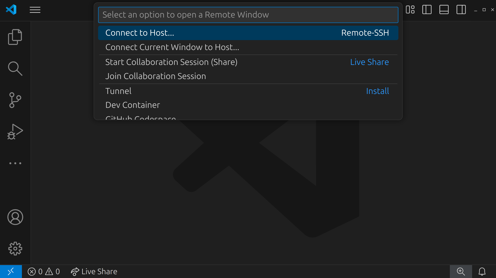
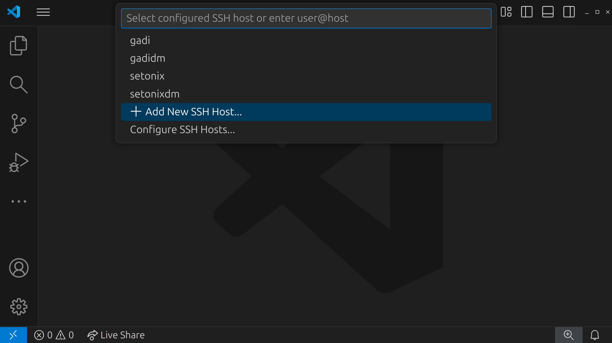
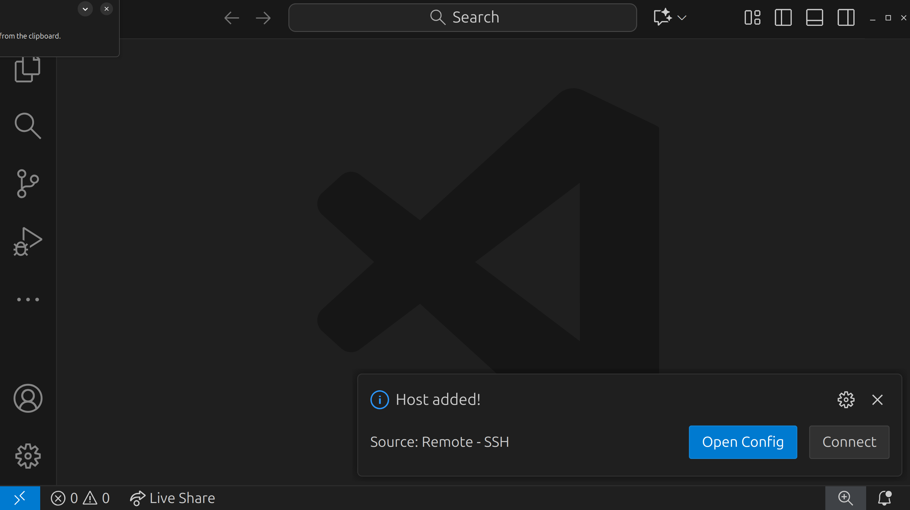
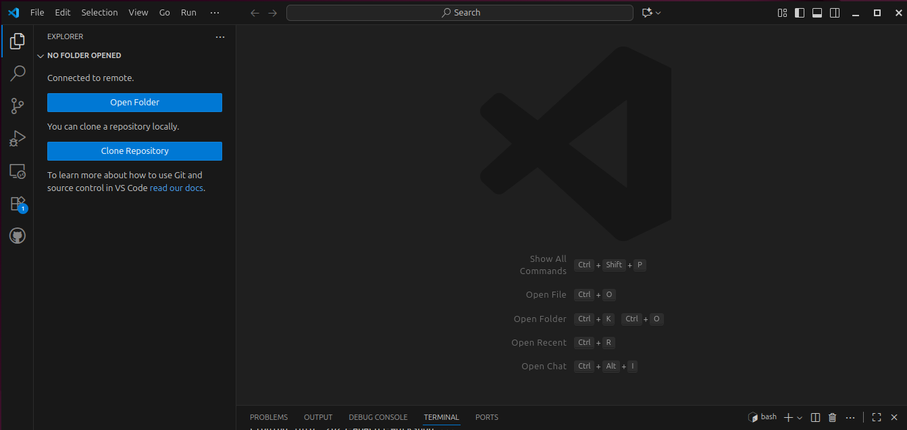

### Connecting to Setonix

We have created training usernames and passwords for you. These are available in a GoogleSheet that can be accessed via a link on the PowerPoint slide. Go to that link and put your name next to one of the usernames to claim it for yourself. That will be your username and password for the whole workshop.

1. Open VScode.

2. Click the blue bar in the bottom left corner of the window. A menu will appear up the top of the window.

    

3. Click `Connect to Host...` and then `+ Add New SSH Host...`

    

4. In the text box, type the following command using your `<username>` selected from the GoogleSheet:

    ```bash
    <username>@setonix.pawsey.org.au
    ```

5. Press the `Enter` key

6. In the next menu, you are prompted to select an SSH configuration file to update with the new settings. Select the default that is in your home directory (`~/.ssh/config`).

7. You will see a confirmation message that the new host was successfully added.

    

8. Repeat steps 1 and 2 again, clicking on the blue SSH bar at the bottom left and selecting `Connect to Host...`

9. Click on the remote that you just added: this will be called `setonix.pawsey.org.au`.

10. A new window will open and a prompt will appear at the top of the window asking for your password. Enter it here and press Enter.

11. A message will appear for a few moments saying `Setting up SSH Host... Initializing VS Code Server`.

12. Once VS Code has been set up on the remote and you are successfully logged in, you will see the text `SSH: setonix.pawsey.org.au` in the blue SSH box in the bottom left corner of the window.


### Install neccessary extensions

1. Select the extensions tab on the left hand side of the window. Search for the `Live Preview` extension and click the blue install button.

2. Click on the blue `Install` button.

3. Once installed, you should see a blue bar in the bottom left corner of the screen. This means that the SSH extension was successfully installed.


### Useful shortcuts that Pawsey sets up for you

To save you some time typing, Pawsey has set up some shortcuts for all users. We will make use of these throughout the hands-on session. Let's look at them:

| Shortcut | Meaning |
|----------|----------|
| $USER | Your unique user ID. e.g. `cou001` or `sbeecroft` |
| $PAWSEY_PROJECT | Your default project code (some people are members of multiple projects). e.g. `courses` or `pawsey1086` |
| $MYSCRATCH | Path to your default scratch directory. e.g. `/scratch/courses/cou001/` |
| $MYSOFTWARE | Path to your default software directory. e.g. `/software/projects/courses/cou001` |


### Set up your workspace and download the lesson material

1. Open the VSCode terminal (`Ctrl + J` for Windows/Linux, `Cmd + J` for Mac) and run the following command:

2. In the same terminal execute the following commands:

    ```bash
    cd $MYSCRATCH
    ```
3. You can now clone the workshop materials into this space.

    ```bash
    git clone https://github.com/tlitfin/2025-ABACBS-workshop
    cd 2025-ABACBS-workshop/exercises/
    ls
    ```

4. If you've successfully cloned the git repo, the `ls exercises` command will return the following:

    ```output
    exercise1  exercise2  exercise3
    ```

5. In the same terminal, execute `pwd` to find the current working directory (eg `/scratch/courses/<username>/2025-ABACBS-workshop/exercises/`). 

6. In the left-hand sidebar of VSCode, click on the "Explorer" tab (an icon that looks like two sheets of paper).

    

7. Click on "Open Folder"

8. In the text box that appears, enter the path of your current working directory identified above (eg `/scratch/courses/<username>/2025-ABACBS-workshop/exercises/`):

9. In the terminal, execute the following command to start an interactive session on a compute node which we can use to execute our workflows.

   ```bash
    salloc -t 2:00:00 -c 2 --mem 4GB
    ```


### Acknowledgements

Setup content copied and adapted with permission from a Sydney Informatics Hub (SIH, University of Sydney) [Nextflow and HPC workshop](https://sydney-informatics-hub.github.io/nextflow-hpc-workshop/).
