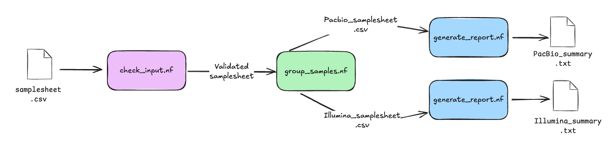
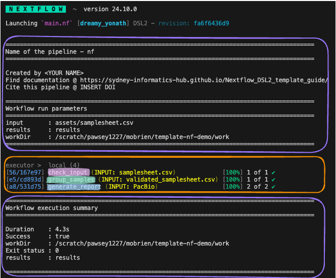

> ## Disclaimer
> - Nextflow is a powerful and feature-rich workflow management system that cannot be fully covered in a short session. 
> - In this overview, we’ll focus on key concepts and practical examples. 
> - For deeper learning, please refer to the official [Nextflow documentation](http://nextflow.io/docs/latest/) and [training](https://training.nextflow.io/latest/).
{: .keypoints}


>## **Background:** What is "Nextflow"?
> Nextflow DSL2, based on Groovy, lets you take your analysis code and easily wrap it into a modular, automated pipeline. It helps bioinformaticians build reproducible workflows that run anywhere.
>
> **Why Use Nextflow?**
>
> - **Portable**: Same workflow can run on your laptop or HPC systems like Setonix (Slurm).
> - **Parallel execution**: Automatically schedules tasks across available compute nodes, reducing manual efforts and speeding up work.
> - **Reproducibility**: Uses containers or environments for consistent results.
> - **Integration with HPC schedulers**: Supports Slurm, Pawsey job scheduling system.
>
>**Core Concepts**
>
>A nextflow pipeline consists of three primary components:
>
> - **Processes** define what to run. Each process can use any Linux-compatible language (e.g., Bash, Python, R, Perl). Processes in are executed independently (i.e., they do not share a common writable state) as **tasks** and can run in parallel, allowing for efficient utilisation of computing resources
> - **Channels** define how data flows between processes. Channels asynchronously carry data between processes and can fan-out (parallel tasks) or fan-in (merge results).
>  - **Workflows** Define the order in which processes connect. They orchestrate execution, specifying dependencies and the overall structure of the pipeline.
>
{: .solution}

### Running a nextflow workflow

Today we’ll run a shortened Nextflow demo based on a [nextflow template](https://github.com/Sydney-Informatics-Hub/template-nf) developed at the University of Sydney. This example highlights basic Nextflow functionality through a simple genomics workflow. For the full demo and detailed explanations, visit the [documentation](https://sydney-informatics-hub.github.io/template-nf-guide/).

> ## Demo Scenario
> This demo simulates the start of a larger workflow where samples need to be grouped by sequencing platform for downstream processing. It uses a single samplesheet (assets/samplesheet.csv) with sample names, FASTQ paths, and platform info (e.g., Illumina or PacBio).
> The workflow runs three processes:
> 
> - check_input – Validates the samplesheet using a custom script in bin/.
> - group_samples – Splits samples into platform-specific sheets.
> - generate_report – Summarises each group in parallel.
> 
>  <p align="center">
>  
>  </p>
> 
> - In this figure data is passed through three processes (coloured pink, green and blue) and data is passed through channels represented by arrows. All intermediary files and results end up in the publishDir.
> - Outputs include validated and grouped samplesheets plus summary reports, illustrating how Nextflow handles input validation, data splitting, and parallel execution.
>
> **Note: The takeaway of this demo is not what the workflow does but how nextflow is designed to support its automation**
{: .callout}

Before beginning the exercise, navigate to the relevant working directory:

```bash
cd $MYSCRATCH/2025-ABACBS-workshop/exercises/exercise1/
ls
```

Use git to clone the workflow code base to your working directory:

```bash
git clone https://github.com/Sydney-Informatics-Hub/template-nf-demo
```

Next, move into the cloned directory and look at the file structure

```bash
cd template-nf-demo/
tree
```

you should see something like this

```
.
├── assets
│   └── samplesheet.csv
├── bin
│   └── samplesheetchecker.sh
├── config
│   ├── gadi.config
│   ├── nimbus.config
│   ├── setonix.config
│   └── standard.config
├── LICENSE
├── main.nf
├── modules
│   ├── check_input.nf
│   ├── generate_report.nf
│   ├── group_samples.nf
│   └── template_process.nf
├── nextflow.config
└── README.md
```

>##  Common Nextflow Files and Directories
>The template’s code repository is organised into a number of files and directories. Hidden directories prefixed with a . can be ignored for now, they are useful for configuring git and github and aren’t related to running your workflow. The code used in the demo workflow are:
> 
> - **main.nf**: the primary execution script, it contains workflow structure, processes, and channels. i.e. It defines your processes (the individual analysis steps) and how data flows between them.
> - **nextflow.config**: the configuration file, it contains a number of property definitions that are used by the pipeline. It specifies runtime settings such as executor, resource limits (CPU, memory), container or Conda environments, and parameter defaults.
> - **conf/** – For organising multiple configuration profiles. You can have multiple config files (e.g., `base.config`, `hpc.config` etc.) for different environments..
> - **assets/**: stores auxillary files. We’ve stored our example samplesheet.csv here.
> - **bin/**: stores custom scripts to be executed by Nextflow processes. We’ve stored a custom script samplesheetchecker.sh run by the first process of this workflow here.
> - **modules/**: contains code run by each process executed by the workflow. Processes have been separated into different .nf files for the sake of readability and easy maintenance.
{: .callout}

Setonix has pre-installed modules that can be loaded by specifying the module name and version.
Load nextflow into your user environment:

```bash
module load nextflow/25.04.6
```

Now, run the pipeline. We are running a minimum pipeline that relies on defaults capture in the `main.nf` and `nextflow.config`:

```bash
nextflow run main.nf --input assets/samplesheet.csv
```

> ## Interpreting Your Nextflow Run
> When you execute a workflow, Nextflow prints information to the terminal.
> - Orange boxes: Automatically generated by Nextflow.
> - Purple boxes: Custom messages defined in main.nf using log.info (optional and editable).
>  <p align="center">
>  
>  </p>
>
> In this example, the executor is local (chosen to avoid queue times for the demo). Using the `--profile` parameter, you could switch to Setonix. 
>
> Under Tasks, you’ll see the three processes (colour matched to our demo scenario figure), with the final task running two jobs in parallel. Each ran successfully, as shown by the tick.
> 
> After running the workflow, several key directories and files are made:
>
> - **The `work/` directory:** As each task is run, a unique sub-directory is created in the work directory. These directories house temporary files and various command logs created by a process. **We can find all information regarding this task that we need to troubleshoot a failed task**.
> Each task in a Nextflow pipeline is assigned a unique identifier (captured in the square brackets in the stdout) based on the input data, parameters, and code used. The output of the task is then saved (cached) in a uniquely named subdirectory within the work directory.
> Nextflow reuses the cached output instead of rerunning the process when supplied the `-resume` flag. This is especially useful when working on large datasets or complex workflows where re-running every step can be time-consuming and computationally expensive.
>
> To Review the directory structure run:
> ```bash
> tree work/
> ```
> output:
> ```
> work/
> ├── 56
> │   └── 167e97ca7a4694c2b5e9d7deee6751
> │       ├── samplesheet.csv -> /template-nf-demo/assets/samplesheet.csv
> │       ├── validated_samplesheet.csv
> │       └── validated_samplesheet.txt
> ├── a8
> │   └── 531d75a177c0d52a10b8295f0f77fa
> │       ├── PacBio_summary.txt
> │       └── samplesheet_pacbio.csv -> /template-nf-demo/work/e5/cd893d12fd4c3ed3c3b1b4af5fdc02/samplesheet_pacbio.csv
> ├── c8
> │   └── c64d35d39715f48187e253dea3840f
> │       ├── Illumina_summary.txt
> │       └── samplesheet_illumina.csv -> /template-nf-demo/work/e5/cd893d12fd4c3ed3c3b1b4af5fdc02/samplesheet_illumina.csv
> └── e5
>     └── cd893d12fd4c3ed3c3b1b4af5fdc02
>         ├── samplesheet_illumina.csv
>         ├── samplesheet_pacbio.csv
>         └── validated_samplesheet.csv -> /template-nf-demo/work/56/167e97ca7a4694c2b5e9d7deee6751/validated_samplesheet.csv
> ```
>  
> - **The `results/` directory:** All final outputs for this workflow will be presented in a directory specified by the `--outdir` flag which is a custom parameter we have defined in the `nextflow.config` as `params.ourdir`. Note the default is set to `results/`.
>
> ```bash
> tree results/
> ```
> output:
> ```
> results/
> ├── Illumina_summary.txt
> ├── PacBio_summary.txt
> ├── runInfo
> │   ├── dag.dot
> │   ├── report.html
> │   ├── timeline.html
> │   └── trace.txt
> ├── samplesheet_illumina.csv
> └── samplesheet_pacbio.csv
> ```
> All expected files have been produced and saved in our result directory.
>
> - **The `.nextflow/` directory**
> This directory contains a cache subdirectory to store cached data such as downloaded files and can be used to speed up subsequent pipeline runs. It also contains a history file which contains a record of pipeline executions including run time, the unique run name, and command line arguments used.
>
> - **The `.nextflow.log` file** 
> This directory contains a cache subdirectory to store cached data such as downloaded files and can be used to speed up subsequent pipeline runs. It also contains a history file which contains a record of pipeline executions including run time, the unique run name, and command line arguments used.
>
{: .prereq }

Congratulations, you have run a nextflow pipeline on setonix!
