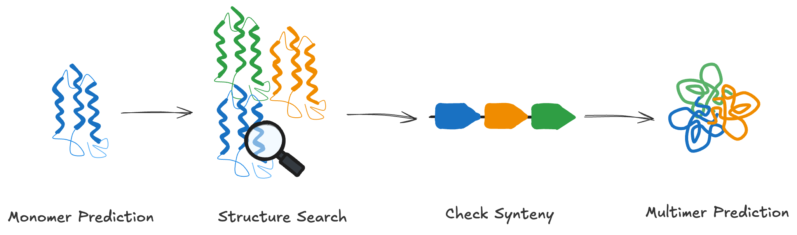

## Genome annotation and why structure matters

Despite the explosion in genomic data, a large fraction of genes remain annotated only as hypothetical proteins. Traditional genome annotation relies on sequence similarity, but this approach breaks down when homologous sequences are missing or highly diverged.

In this session, we’ll walk through a case study from the genome of [Candidatus Protochlamydia naegleriophila](https://www.ncbi.nlm.nih.gov/nuccore/LN879502.1).

Before commencing the exercise, navigate to the relevant working directory:

```bash
cd $MYSCRATCH/2025-ABACBS-workshop/exercises/exercise1/
```

Download the Genbank genome annotation file:
```bash
wget https://ftp.ncbi.nlm.nih.gov/genomes/all/GCF/001/499/655/GCF_001499655.1_PNK1/GCF_001499655.1_PNK1_genomic.gbff.gz
```

Count the number of `hypothetical protein` annotations:
```bash
zgrep "hypothetical" GCF_001499655.1_PNK1_genomic.gbff.gz | wc -l
```

Count the number of `protein coding` genes:
```bash
zgrep "protein_id" GCF_001499655.1_PNK1_genomic.gbff.gz | wc -l
```

Note that `802` / `2516` (**>30%**) of the protein-coding genes do not have functional annotations.

**The good news:** protein structures are often more conserved than sequences, and they are tightly linked to function. Recent advances in structure prediction (*using tools we’ll explore today*) allow us to analyse structures at genomic scale. By comparing predicted 3D structures to known proteins, we can uncover functional relationships that sequence-based approaches miss.


## Representative example: uncovering the function of a “hypothetical protein”
We’ll examine a gene annotated as a conserved hypothetical protein (locus tag PNK_0205) and explore how protein structure-based annotation can yield new functional hypotheses. 


> ## Strategy
> - Predict the protein’s 3D structure.
> - Search for similar annotated structures.
> - Compare gene neighborhoods of our protein and the matched structure.
> - Predict interaction partners based on known functional associations.
> - Integrate all evidence to propose a functional hypothesis.
> 
> 
> <p align="center">
> 
> </p>
> 
{: .prereq}


