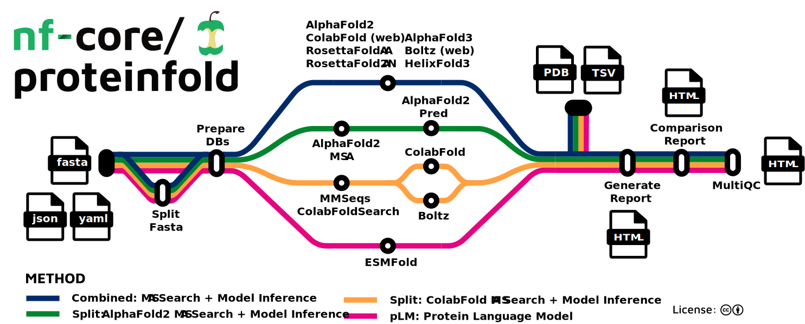

## Setup

Before commencing the exercise, navigate to the relevant working directory:

```bash
cd $MYSCRATCH/2025-ABACBS-workshop/exercises/exercise3/
ls
```

You should see the following files which will be used in this exercise:

```
abacbs_profile.config  examples  fasta  samplesheet.csv
```

## nf-core/proteinfold

[proteinfold](https://github.com/nf-core/proteinfold/tree/dev) is a Nextflow pipeline designed to support numerous models for molecular structure prediction.

<p align="center">

</p>

Today, we will use proteinfold to predict the structure of our uncharacterised protein using the AlphaFold2 model.

We will use a development branch (`commit: 53a1008`) to access some of the latest features that are not yet available in the current release.

```bash
#module load nextflow/25.04.6 # This should still be loaded from the previous exercise
nextflow pull nf-core/proteinfold -r 53a1008
```

```bash
tree $NXF_HOME/assets/nf-core/proteinfold/ -L 2 --filelimit=20
```

> ## Result
> ~~~
> ├── assets
> │   ├── adaptivecard.json
> │   ├── comparison_template.html
> │   ├── dummy_db
> │   ├── dummy_db_dir
> │   ├── email_template.html
> │   ├── email_template.txt
> │   ├── methods_description_template.yml
> │   ├── multiqc_config.yml
> │   ├── nf-core-proteinfold_logo_light.png
> │   ├── NO_FILE
> │   ├── NO_FILE_PAE
> │   ├── report_template.html
> │   ├── samplesheet.csv
> │   ├── schema_input.json
> │   ├── sendmail_template.txt
> │   └── slackreport.json
> ├── bin
> │   ├── extract_metrics.py
> │   ├── fasta_to_alphafold3_json.py
> │   ├── fix_obsolete.py
> │   ├── generate_comparison_report.py
> │   ├── generate_report.py
> │   ├── mmcif_to_pdb.py
> │   ├── msa_manager.py
> │   ├── __pycache__
> │   └── utils.py
> ├── CHANGELOG.md
> ├── CITATIONS.md
> ├── CODE_OF_CONDUCT.md
> ├── conf [32 entries exceeds filelimit, not opening dir]
> ├── docs
> │   ├── images
> │   ├── output.md
> │   ├── README.md
> │   └── usage.md
> ├── LICENSE
> ├── main.nf
> ├── modules
> │   ├── local
> │   └── nf-core
> ├── modules.json
> ├── nextflow.config
> ├── nextflow_schema.json
> ├── nf-test.config
> ├── README.md
> ├── ro-crate-metadata.json
> ├── subworkflows
> │   ├── local
> │   └── nf-core
> ├── tests
> │   ├── alphafold2_download.nf.test
> │   ├── alphafold2_download.nf.test.snap
> │   ├── alphafold2_split.nf.test
> │   ├── alphafold2_split.nf.test.snap
> │   ├── alphafold3.nf.test
> │   ├── alphafold3.nf.test.snap
> │   ├── colabfold_download.nf.test
> │   ├── colabfold_download.nf.test.snap
> │   ├── colabfold_local.nf.test
> │   ├── colabfold_local.nf.test.snap
> │   ├── colabfold_webserver.nf.test
> │   ├── colabfold_webserver.nf.test.snap
> │   ├── default.nf.test
> │   ├── default.nf.test.snap
> │   ├── esmfold.nf.test
> │   ├── esmfold.nf.test.snap
> │   ├── nextflow.config
> │   ├── split_fasta.nf.test
> │   └── split_fasta.nf.test.snap
> ├── tower.yml
> └── workflows
>     ├── alphafold2.nf
>     ├── alphafold3.nf
>     ├── boltz.nf
>     ├── colabfold.nf
>     ├── esmfold.nf
>     ├── helixfold3.nf
>     └── rosettafold_all_atom.nf
> ~~~
{: .solution}


> ## Setup environment
> The previous exercise didn’t use containers, but they are one of the most effective ways to manage software in workflow development, especially with Nextflow.
> 
> In this exercise, we will be using singularity containers and so we need to load the corresponding module on Setonix.
>
> ```bash
> module load singularity/4.1.0-slurm
> ```
> <br>
> > ## **Background:** Why containers?
> >
> > A container is a lightweight, portable environment that bundles an application together with everything it needs to run such as libraries, dependencies, and system tools. It is a simple and reliable alternative to installing software directly on your system or HPC environment (which often requires managing dependencies manually).
> > On HPC systems, this means isolation from other environments, reproducibility across platforms, and simplified maintenance without manual installs or dependency troubleshooting. 
> >
> > It is recommended to pull containers from trusted sources like [BioContainers](https://biocontainers.pro/), [quay.io](quay.io) or [Seqera](https://seqera.io/containers/). During execution, Nextflow automatically pulls required images, often from these repositories, and stores them in the work directory.
> {: .solution} 
>
> Before executing the workflow, we will define a number of environment variables.
> 
> These variables tell Nextflow and Singularity where to find and store container images so you don’t waste time and space downloading them repeatedly.
> 
> **Note: These environment variables need to be set each time you log in to the HPC system (or include them in your job submission script before running Nextflow).**
>
> ~~~
> mkdir $MYSCRATCH/containers
> export SINGULARITY_CACHEDIR=$MYSCRATCH/containers
> export SINGULARITY_LIBRARYDIR=/scratch/references/abacbs2025/containers
> export NXF_SINGULARITY_CACHEDIR=$MYSCRATCH/containers
> export NXF_SINGULARITY_LIBRARYDIR=/scratch/references/abacbs2025/containers
> ~~~
> {: .source}
> <br>
> Confirm that several images are visible to nextflow by:
>
> ~~~
> ls $NXF_SINGULARITY_LIBRARYDIR
> ~~~
> {: .source}
> <br>
> Output:
> ~~~
> alphafold2_pred-single.sif
> alphafold2-single.sif
> community-cr-prod.seqera.io-docker-registry-v2-blobs-sha256-24-241f0746484727a3633f544c3747bfb77932e1c8c252e769640bd163232d9112-data.img
> community-cr-prod.seqera.io-docker-registry-v2-blobs-sha256-ef-eff0eafe78d5f3b65a6639265a16b89fdca88d06d18894f90fcdb50142004329-data.img
> depot.galaxyproject.org-singularity-multiqc-1.27--pyhdfd78af_0.img
> depot.galaxyproject.org-singularity-multiqc-1.29--pyhdfd78af_0.img
> depot.galaxyproject.org-singularity-python-3.8.3.img
> quay.io-nf-core-proteinfold_alphafold2_msa-dev.img
> ~~~
> <br>
> If you execute a Nextflow workflow that requires a container that is not located in the shared `$NXF_SINGULARITY_LIBRARYDIR`, the pipeline will attempt to pull the container from a hosted repository and store the image in your personal `$NXF_SINGULARITY_CACHEDIR`.
>
> > ## **Background:** Why Environment Variables?
> > When using containers on HPC systems, Nextflow needs to know where to store and retrieve container images. 
> > By default, it downloads containers into the workflow’s `work/` directory, which can be inefficient and waste storage if you run multiple workflows.
> >
> > Setting environment variables allows you to:
> > - Cache container images in a shared location → Avoid repeated downloads and speed up execution.
> > - Control storage paths → Prevent filling up your home directory or job scratch space.
> > - Ensure reproducibility → Use the same cached image across multiple runs and workflows.
> {: .solution}
> 
>
{: .keypoints}

## AMD-compatible images
- The proteinfold workflow includes several modules that are executed on the GPU. 
- Default containers [hosted](https://quay.io/organization/nf-core) by the nf-core organisation support NVIDIA hardware and will not run on the Setonix AMD GPUs. 
- Pawsey provides a number of AMD-compatible [containers](https://quay.io/organization/pawsey) which can be used to run structure prediction models. 
- Pre-built images have been provided for the workshop today at `/scratch/references/abacbs2025/containers`. 
- We can configure the workflow to use these non-standard images by defining their path in a custom Nextflow config.

> ## Note
> Normally AlphaFold2 runs 5 different models and picks the best result.
> 
> Today we are using a modified version of AlphaFold2 that only runs a single model to reduce execution time.
{: .prereq}

Check the `abacbs_workshop.config` file to confirm that the workflow modules are configured to use non-standard images available on Setonix:

```bash
grep -w RUN_ALPHAFOLD2 abacbs_profile.config -A3
```

Output:
```
withName: 'RUN_ALPHAFOLD2' {
    container = '/scratch/references/abacbs2025/containers/alphafold2-single.sif'
    time = { 12.h }
}
```

## Reference data
- Recall that structure prediction relies on collecting homologous proteins in a multiple sequence alignment (MSA) to identify coevolutionary information.
- These homologs are identified from enormous reference sequence databases (>1TB).
- Check that these databases are available on Setonix.

```bash
tree /scratch/references/abacbs2025/databases/ -L 1
```

You should see that the required AlphaFold2 databases and model parameters are available here.

```
databases/
    ├── mgnify
    ├── pdb70
    ├── pdb_mmcif
    ├── pdb_seqres
    ├── small_bfd
    ├── uniprot
    └── uniref90 
```

> ## Note
> - Today, we are using miniature versions of the databases to reduce execution time for the purpose of the workshop. 
> - These databases will **NOT** generate high-quality predictions for other protein targets. 
> - Full size databases are available at `/scratch/references/alphafold_feb2024/databases/`.
{: .discussion}