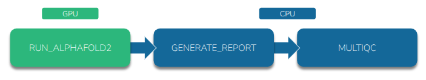
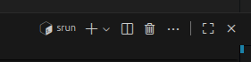
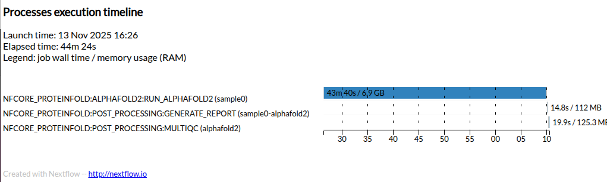
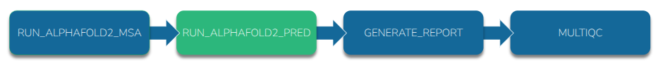
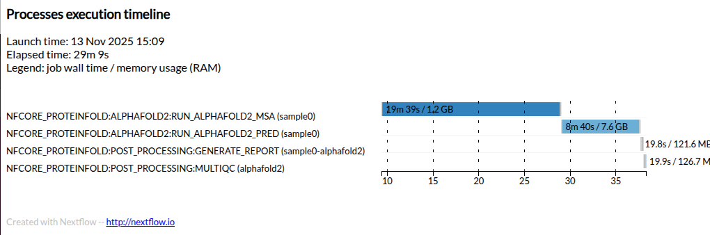

## Prepare samplesheet

We have prepared a Nextflow samplesheet containing our protein input in FASTA format. 

Each prediction must be given a unique `id` and an input file containing the target `sequence`

```bash
cat samplesheet.csv
```

Output:
``` csv
id,fasta
sample0,fasta/PNK_0205.fasta
```

## Standard run

This is the structure of a standard proteinfold workflow execution:

<p align="center">

</p>

1. Execute the workflow using the script below:

    ~~~ bash
    nextflow run nf-core/proteinfold/ \
        --input samplesheet.csv \
        --outdir output/ \
        --db /scratch/references/abacbs2025/databases/ \
        --mode alphafold2 \
        --use_gpu \
        --alphafold2_mode "standard" \
        -c abacbs_profile.config \
        --slurm_account $PAWSEY_PROJECT \
        -r 53a1008
    ~~~


## Job monitoring

1. Open a new VScode terminal using the `+` in the top-right corner of the terminal panel.

    

2. In our second terminal we can confirm that our job is running with:

    ```bash
    squeue --me
    ```
    ~~~
    JOBID        USER ACCOUNT                   NAME EXEC_HOST ST     REASON START_TIME       END_TIME  TIME_LEFT NODES   PRIORITY       QOS
    34776177  tlitfin pawsey1017-gpu  nf-NFCORE_PROT nid002166  R       None 08:15:36         20:15:36   11:36:58     1      75399    normal
    ~~~

3. Similarly, we can connect to the node that is executing the job to check the status (ie the node id under EXEC_HOST).
Replace <node> with the id under EXEC_HOST (eg nid002166 from the example above).

    ```bash
    ssh <node>
    ```

4. Type `yes` when prompted and then enter your workshop account password at the password prompt. **Note: you can only connect to nodes where you have an active job running**

    ```bash
    watch rocm-smi
    ```

5. We can monitor GPU utilization in the last column:

    ~~~
    ========================================= ROCm System Management Interface =========================================
    =================================================== Concise Info ===================================================
    Device  Node  IDs              Temp    Power  Partitions          SCLK    MCLK     Fan  Perf  PwrCap  VRAM%  GPU%
    ^[3m              (DID,     GUID)  (Edge)  (Avg)  (Mem, Compute, ID)                                                   ^[0m
    ====================================================================================================================
    0       11    0x7408,   49174  35.0°C  N/A    N/A, N/A, 0         800Mhz  1600Mhz  0%   auto  0.0W    74%    0%
    ====================================================================================================================
    =============================================== End of ROCm SMI Log ================================================
    ~~~


### Job Accounting

1. After the workflow has completed, view the `execution_timeline` HTML file located in the `output/pipeline_info/` directory.

2. You can find the file by navigating to the `exercises/exercise2/output/pipeline_info/` directory in the `VSCode` file browser in the left-hand panel

3. Right-click the `execution_timeline` file and select `Preview`.


> ## Execution timeline
> 
> Here is an example timeline from a full AlphaFold2 run for this target protein.
> 
> Your execution time will be greatly reduced by using **dummy** miniature databases and generating only a single AlphaFold2 model output.
> 
> 
> 
{: .solution }

> ## Service units
> 
> - All Pawsey users are allocated service units (SU) which are consumed by running jobs on Setonix.
> - The SU cost of each job is determined based on the requested resources.
> - We can use the Pawsey [calculator](https://pawseysc.github.io/su-calculator/) to estimate the SU cost of our workflow execution.
> - A full scale execution was completed in 0.75 hours using a single GPU (neglible CPU time).
>
> ~~~
> Calculation Breakdown
> SUs = Partition Charge Rate × Max Proportion × Nodes × Hours
> 512 × 0.1250 × 1 × 0.75 = 48 SUs
> GPU Proportion: 1 GCDs / 8 total GCDs = 0.1250
> ~~~
> 
> - A basic run of AlphaFold2 using the official implementation consumes 48 SUs on the Setonix system. 
> - Compare this with the execution time for the demo run from this workshow using the miniature databases.
>
{: .solution}


## Split MSA run

Recall that AlphaFold2 relies on generating an MSA by searching large sequence databases.

This search process does not invoke the GPU which means that it is wasteful to request a GPU node until the MSA has been generated.

We can split AlphaFold2 into a part that requires the **CPU** and a part that requires the **GPU**. Nextflow can send jobs to the appropriate resource.

<p align="center">

</p>

1. Re-run proteinfold to predict the same protein but this time use AlphaFold2 in `"split_msa_prediction"` mode:

    ~~~ bash
    nextflow run nf-core/proteinfold \
        --input samplesheet.csv \
        --outdir output-split/ \
        --db /scratch/references/abacbs2025/databases/ \
        --mode alphafold2 \
        --use_gpu \
        --alphafold2_mode "split_msa_prediction" \
        -c abacbs_profile.config \
        --slurm_account $PAWSEY_PROJECT \
        -r 53a1008
    ~~~


### Job Accounting

1. After the workflow has completed, view the `execution_timeline` HTML file located in the `output-split/pipeline_info/` directory.

2. You can find the file by navigating to the `exercises/exercise2/output/pipeline_info/` directory in the `VSCode` file browser in the left-hand panel

3. Right-click the `execution_timeline` file and select `Preview`.


> ## Execution timeline
> 
> Here is an example timeline from a full AlphaFold2 run using `"split_msa_prediction"` for this target protein.
> 
> Your execution time will be greatly reduced by using **dummy** miniature databases and generating only a single AlphaFold2 model output.
> 
> 
> 
>
>
{: .solution }

> ## Service units
> 
> We can again use the Pawsey [calculator](https://pawseysc.github.io/su-calculator/) to estimate the service unit (SU) cost.
> 
> A full scale execution was completed in 0.16 hours using a single GPU and 0.3 hours of CPU time.
>
> **CPU**
> ~~~
> SUs = Partition Charge Rate × Max Proportion × Nodes × Hours
> 128 × 0.0696 × 1 × 0.3 = 2.672 SUs
>
> Core Proportion: 8 cores / 128 total cores = 0.0625
> Memory Proportion: 16 GB / 230 GB total for accounting = 0.0696
> Max Proportion (Memory): 0.0696
> ~~~
> <br>
> **GPU**
> ~~~
> SUs = Partition Charge Rate × Max Proportion × Nodes × Hours
> 512 × 0.1250 × 1 × 0.16 = 10.24 SUs
> GPU Proportion: 1 GCDs / 8 total GCDs = 0.1250
> ~~~
>
> Compare the SU cost of running all work on a GPU node compared with splitting the job to more efficiently use the appropriate resource.
>
> ~~~
> Standard:               48   SUs
> Split MSA: 2.7 + 10.2 = 12.9 SUs
> ~~~
>
{: .solution}