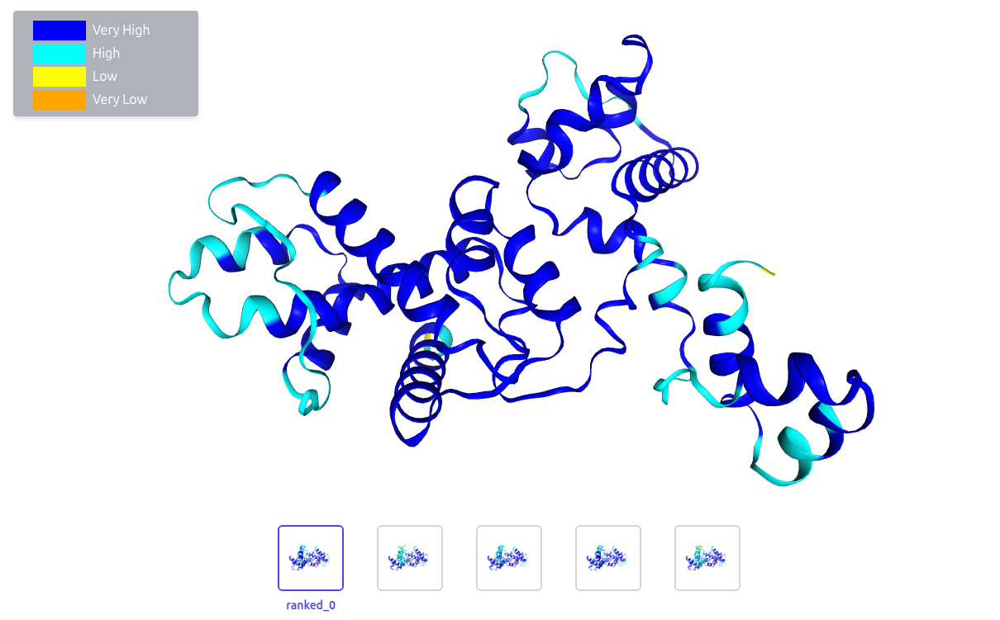
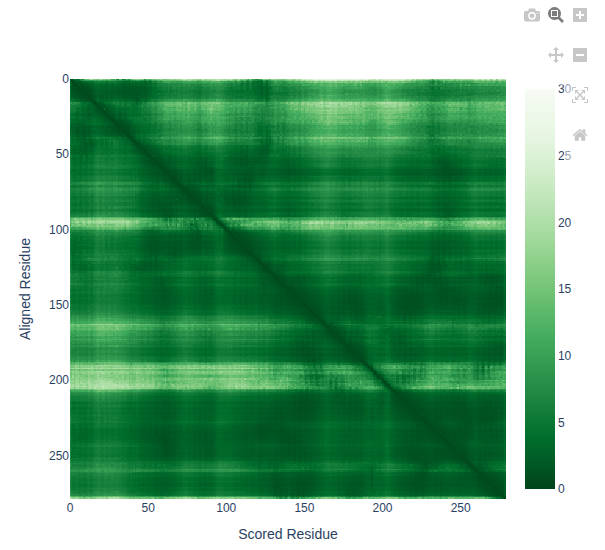
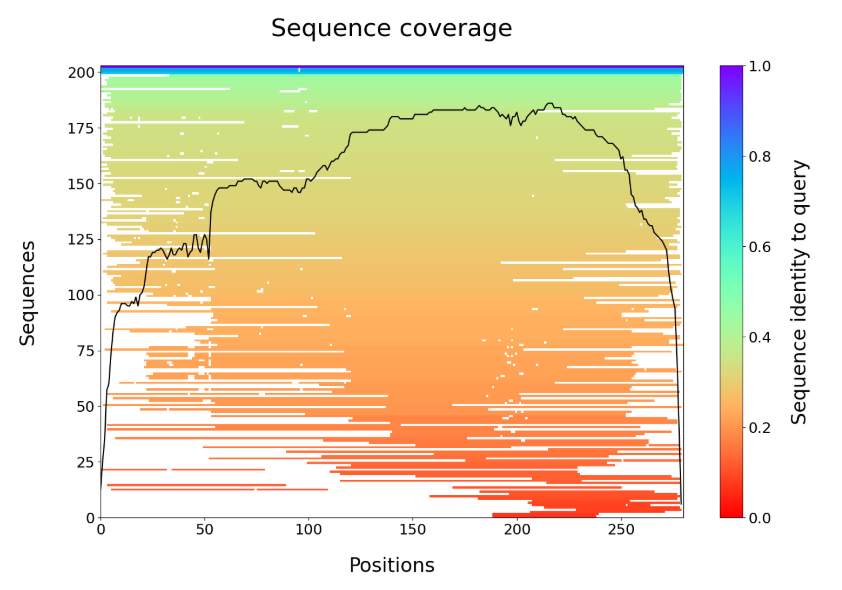
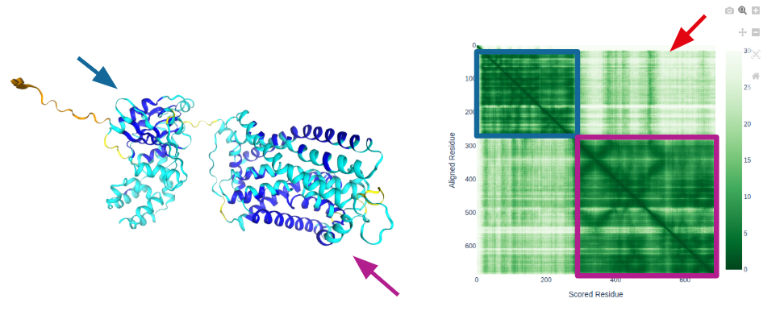
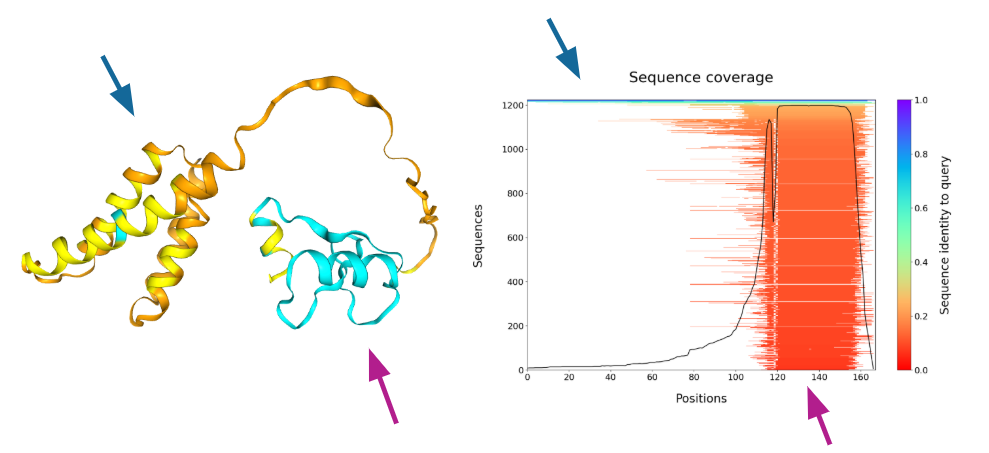

## Inspect the outputs

You can inspect the outputs generated by the workflow using the code below:

```bash
tree output/ -L 4
```

> ## View outputs
> ~~~
> output
> ├── alphafold2
> │   └── standard
> │       ├── sample0
> │       │   ├── paes
> │       │   ├── PNK_0205.1
> │       │   ├── sample0_alphafold2_msa.tsv
> │       │   ├── sample0_alphafold2.pdb
> │       │   ├── sample0_iptm.tsv
> │       │   ├── sample0_plddt.tsv
> │       │   └── sample0_ptm.tsv
> │       └── top_ranked_structures
> │           └── sample0.pdb
> ├── generate
> │   ├── sample0_alphafold2_report.html
> │   ├── sample0_alphafold2_seq_coverage.png
> │   └── sample0_coverage_LDDT.html
> ├── multiqc
> │   ├── alphafold2_alphafold2_multiqc_report_data
> │   │   ├── llms-full.txt
> │   │   ├── multiqc_citations.txt
> │   │   ├── multiqc_data.json
> │   │   ├── multiqc.log
> │   │   ├── multiqc.parquet
> │   │   ├── multiqc_software_versions.txt
> │   │   └── multiqc_sources.txt
> │   └── alphafold2_alphafold2_multiqc_report.html
> └── pipeline_info
>     ├── execution_report_2025-11-16_13-42-54.html
>     ├── execution_timeline_2025-11-16_13-42-54.html
>     ├── execution_trace_2025-11-16_13-42-54.txt
>     ├── nf_core_proteinfold_software_mqc_versions.yml
>     ├── params_2025-11-16_13-42-58.json
>     └── pipeline_dag_2025-11-16_13-42-54.html
> ~~~
{: .solution}

> ## Primary outputs
> 
> The workflow extracts `pAE`, `ipTM`, `pTM` and `pLDDT` scores in a model agnostic `tsv` format.
> 
> The atomic coordinates of the structure prediction with the highest confidence can be found in the `sample0_alphafold2.pdb` file.
> 
> Summary reporting information can be visualised in the `sample0_alphafold2_report.html` file.
{: .prereq}

1. After the workflow has completed, view the `sample0_alphafold2_report.html` file located in the `output/generate/` directory.

2. You can find the file by navigating to the `exercises/exercise2/output/generate/` directory in the VSCode file browser on the left-hand panel.

3. Right-click the `sample0_alphafold2_report.html` file and select `Preview`.


## Predicted local distance difference test (pLDDT)

pLDDT is a measure of the local confidence of each residue and is typically interpreted in 4 bands:

- Very high confidence: pLDDT > `90`
- Confident: `90` > pLDDT > `70`
- Low confidence: `70` > pLDDT > `50`
- Very low confidence: pLDDT < `50`
 
Low pLDDT often coincides with regions of intrinsic disorder.

External resource: [EBI AlphaFold guide - pLDDT](https://www.ebi.ac.uk/training/online/courses/alphafold/inputs-and-outputs/evaluating-alphafolds-predicted-structures-using-confidence-scores/plddt-understanding-local-confidence/)

> ## Challenge
> What conclusion can be drawn based on the application of pLDDT to the structure below?
{: .challenge}

<p align="center">

</p>

> ## Solution
> Our target structure has been predicted with high confidence.
{: .solution}


## Predicted aligned error (pAE)

- When we **do** know the true structure of a protein, the "aligned error" is the distance between a predicted atom and it's true position after superimposing the 2 structures. 
- When we **do not** know the true structure, we can predict what the hypothetical aligned error would be (pAE). 
- Each row of the pAE matrix (i,j) represents the pAE of residues (j) assuming that the structures are superimposed based on residue (i). 
- A low pAE is indicated by a dark green color and is often interpreted as high confidence about the relative positions of the 2 residues.
- `pTM` is a score calculated from the best row of the pAE matrix and represents an overall quality score.
- `ipTM` is the same score but only considering PAE between different chains.

External resources: 
- [EBI AlphaFold guide - PAE](https://www.ebi.ac.uk/training/online/courses/alphafold/inputs-and-outputs/evaluating-alphafolds-predicted-structures-using-confidence-scores/pae-a-measure-of-global-confidence-in-alphafold-predictions/)
- [EBI AlphaFold guide - confidence](https://www.ebi.ac.uk/training/online/courses/alphafold/inputs-and-outputs/evaluating-alphafolds-predicted-structures-using-confidence-scores/confidence-scores-in-alphafold-multimer/)

> ## Challenge
> What does the pAE matrix below indicate?
{: .challenge}

<p align="center">

</p>

> ## Solution
> Our target structure has been predicted with high confidence.
{: .solution}


## Sequence coverage

Recall that high quality predictions of novel structures rely on co-evolution data derived from multiple sequence alignments.
 
If our structure prediction is poor quality, it may be because insufficient sequences were identified to produce a high-quality prediction.
 
In our case, we have identified ~200 sequences with good coverage of our target protein (see figure below).

<p align="center">

</p>

There are several other outputs in the `examples/` directory. 

How would you interpret the output reports in the following two challenges?

> ## Challenge 1
> 
> After the workflow has completed, view the `example1_alphafold2_report.html` file located in the `examples/` directory.
> 
> You can find the file by navigating to the `exercises/exercise2/examples/` directory in the VS-code file browser on the left-hand panel.
> 
> Right-click the `example1_alphafold2_report.html` file and select `Preview`.
{: .challenge}

> ## Solution 1
> 
> <p align="center">
> 
> </p>       
> 
> 
> **Interpretation:**
> - This protein contains 2 domains that are confidently predicted.
> - The relative position of the two domains is uncertain
> - The N-terminus is likely disordered
{: .solution}

> ## Challenge 2
> 
> After the workflow has completed, view the `example2_alphafold2_report.html` file located in the `examples/` directory.
> 
> You can find the file by navigating to the `exercises/exercise2/examples/` directory in the VS-code file browser on the left-hand panel.
> 
> Right-click the `example2_alphafold2_report.html` file and select `Preview`.
{: .challenge}

> ## Solution 2
> 
> <p align="center">
> 
> </p>       
> 
> 
> **Interpretation:** The N-terminal domain is predicted with low confidence - likely due to low MSA coverage.
{: .solution}


