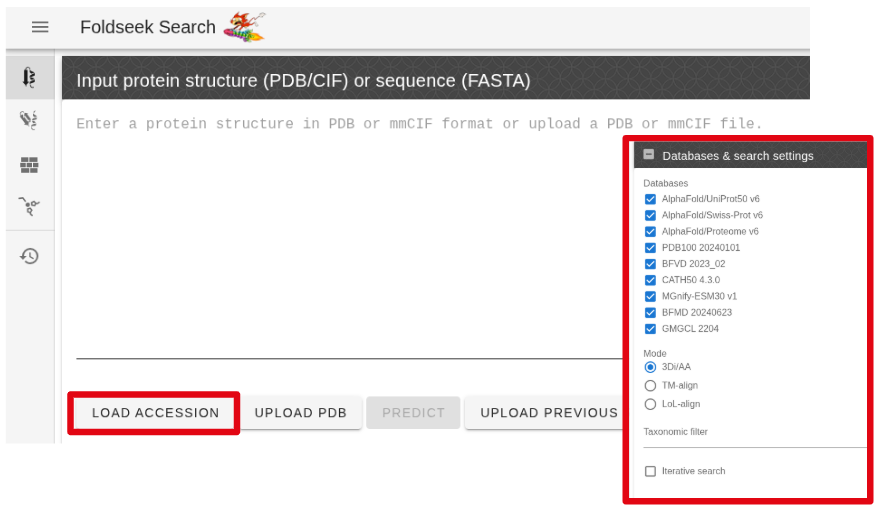
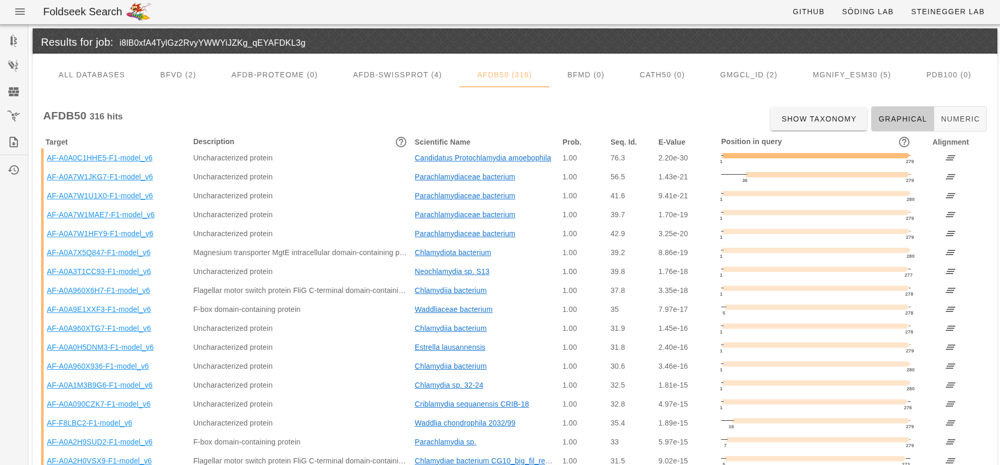
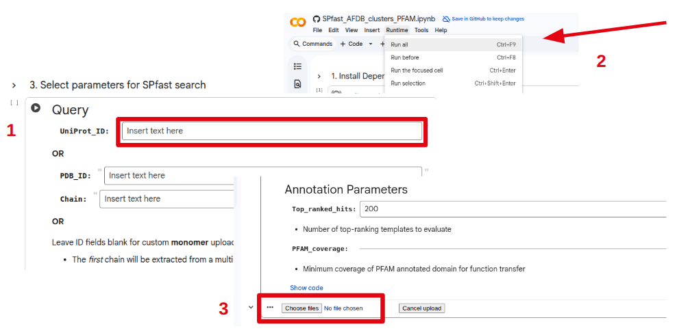

> ## Note
> 
> Now that we have our high-confidence predicted structure, we can use it to search a large database of annotated structures.
> 
> Similar annotated structures could provide a hypothesis about the likely function of our target protein.
{: .prereq}

## Download structure predictions

From your **local terminal**, download the `sample0_alphafold2.pdb` file located in the `output/alphafold2/standard/sample0/` directory.

``` bash
scp <username>@setonix.pawsey.org.au:/scratch/courses/<username>/2025-ABACBS-workshop/exercises/exercise2/output/alphafold2/standard/sample0/sample0_alphafold2.pdb ./
```
**Windows users** can download from WinSCP.

## Foldseek

The [Foldseek server](https://search.foldseek.com/search) is extremely fast and useful for identifying structural matches across a range of experimental and predicted structure databases.

Upload our predicted PDB structure to the foldseek server and search for similar structures.

> ## Input form
> 
> <p align="center">
> 
> </p>
> 
> - Ensure that the check-boxes for all databases are selected.
{: .keypoints}

> ## Results
> 
> 
> 
> 
> - Browse the tabs to see the top hits in various protein structure databases.
> - The most similar proteins in AFDB50 are also uncharacterised proteins.
> - There are some hits to proteins with various annotations (MgtE, FliG, F-box).
> - Many fringe hits are annotated with FliG, YscK and SctK - a component of the Type III secretion system.
>
{: .solution }

## SPfast 
[SPfast](https://colab.research.google.com/github/tlitfin/SPfast/blob/main/notebooks/SPfast_AFDB_clusters_PFAM.ipynb) is an alternative strategy for structure-based search and provides a minimal set of hits based on non-redundant PFAM clan annotations.

1. Upload our predicted PDB structure by **leaving the input fields blank.** 
2. Select **Run all** to execute search for annotated structures using SPfast.
3. **Wait ~3 minutes** for the file upload prompt to appear under the 3rd cell and upload your predicted structure (`sample0_alphafold2.pdb`).

> ## Input form
> 
> <p align="center">
> 
> </p>
> 
{: .keypoints}

SPfast will take about ~7 minutes after uploading the query structure.

> ## Results
> 
> | Query                      | Template   | Score | PFAM coverage | InterPro  | PFAM    | Clan            | Count |
> |-----------------------------|------------|-------|----------------|-----------|---------|-----------------|-------|
> | sample0_alphafold2          | A0A7V7WJC0 | 0.972 | 0.851          | IPR023087 | PF01706 | FliG            | 3     |
> | sample0_alphafold2          | A0A5E4W8M8 | 0.903 | 0.941          | IPR009510 | PF06578 | YscK            | 3     |
> | sample0_alphafold2          | A0A2Y0G0F7 | 0.766 | 0.969          | IPR013388 | PF09482 | OrgA_MxiK       | 3     |
> | sample0_alphafold2          | A0A2S7ERH1 | 0.746 | 0.895          | IPR013393 | PF09502 | HrpB4           | 1     |
> | sample0_alphafold2          | Q8ZPP3     | 0.697 | 0.862          | IPR025292 | PF13327 | T3SS_LEE_assoc  | 1     |
> 
> 
> This collection of similar structures are annotated with PFAM clans (FliG, YscK, OrgA_MxiK, HrpB4, T3SS_LEE_assoc) which all relate to a Type III secretion system (T3SS) adaptor protein (SctK gene).
> 
> This suggests a potential related function for our uncharacterized gene.
{: .solution }

> ## Careful
> 
> Structural similarity does **NOT** guarantee a related function. 
> 
> Shared structural scaffolds can sometimes adopt highly divergent functions.
> 
> We can look for complementary evidence to support structure-based annotations.
{: .discussion}

## Synteny

T3SS genes are often found in operons.

Return to our original [assembly](https://www.ncbi.nlm.nih.gov/nuccore/LN879502.1) and look at the gene neighbors of our target locus (PNK_0205).

> ## Gene Neighborhood
> ~~~
> gene            complement(256361..257014)
>                 /gene="sctL"
>                 /locus_tag="PNK_0204"
> CDS             complement(256361..257014)
>                 /gene="sctL"
>                 /locus_tag="PNK_0204"
>                 /function="Flagellar biosynthesis/type III secretory
>                 pathway protein"
>                 /codon_start=1
>                 /transl_table=11
>                 /product="putative type III secretion protein SctL"
>                 /protein_id="CUI15842.1"
>                 /translation="MSKKFFSLIYGDQIHTAPETKVIPADSFSVLQDASQVLELIKQD
>                 AEKYRMQVVKESEQLKEHAEKEGYEEGFKKWAEHLVNLEKEIEKVHQELQQLVIPVAL
>                 KAAKKIVGKEIELSEDVIVDIVASNLKAVAQHKKVTIFVNKKDLDVLDKNKPRLRDLF
>                 ESLESLSIRPRDDVASGGCIIETEIGIINAQLEHRWRVLEKAFEGLVKTSPEPEKGS"
> gene            complement(257017..257859)
>                 /locus_tag="PNK_0205"
> CDS             complement(257017..257859)
>                 /locus_tag="PNK_0205"
>                 /codon_start=1
>                 /transl_table=11
>                 /product="conserved hypothetical protein"
>                 /protein_id="CUI15843.1"
>                 /translation="MDKRGWMMLRVFINCYNPKAGEALLKFLPQEEVQAVLSQDIRST
>                 DLTPILYQPQKLLERMHYSWIEPLLGGFPEKLHPLVMAALTQEQISGLNPVIAPSTLS
>                 NPVKTFIINQLYTLLKADEHLPYDYLPETDLSPLGTWSKARLTELIDFLGLHDLASEM
>                 RHIVDKNQLKNIYTSLSSKQFYYLKVCLHQKEILSVPKLGIDPSKRDSTKLKRIVHRR
>                 GLLRLGKALCGQHPDFVWYLAHTLDTGRGKLILNAYQPESVPQVTSFLKGQVLNLMNF
>                 LKSE"
> gene            complement(257888..258895)
>                 /gene="sctJ"
>                 /locus_tag="PNK_0206"
> CDS             complement(257888..258895)
>                 /gene="sctJ"
>                 /locus_tag="PNK_0206"
>                 /function="Type III secretory pathway, lipoprotein EscJ"
>                 /codon_start=1
>                 /transl_table=11
>                 /product="type III secretion lipoprotein SctJ"
>                 /protein_id="CUI15844.1"
>                 /translation="MKINCVAARTSIYRFLHQLMVFITLVSVLTSCESRRVIVNGLEE
>                 KEANEILVFLSTKGINATKVQAATEGGGGGKGILWNISVEETQANEAMALLNQVGLPR
>                 RRGQNLLGIFANTSLVPSGMQEKIRYQAGLAEQIASTIRKIDGVLDADVQISFPDEDP
>                 LNPNAPKQKITASVYVKHNGVLDDPNAHLTTRIKRLVSGSVNGLDYDNVTVIGDKARY
>                 GETPLGGLGGSLGDEEKQYVNVWSIVLAKDSLSRFRIIFFAFTISLVLLLLALIWLLW
>                 KFLPLLKKVGGFKQLLSFHPIQLGDIATEAKAPEATDAKKEEKAKKSEDDTANQGIDE
>                 T"
> ~~~
{: .solution}

PNK_0205 is between the **SctL** and **SctJ** genes which are also components of the T3SS machinery.

In genomes where it is annotated, **SctK** is overwhelmingly found between **SctL** and **SctJ**.

The gene neighborhood of our uncharacterised gene is consistent with our protein structure based annotation.

> ## Note:
> Structure-based annotation is on the roadmap for another nf-core pipeline - [proteinannotator](https://nf-co.re/proteinannotator/dev/)
{: .prereq}

