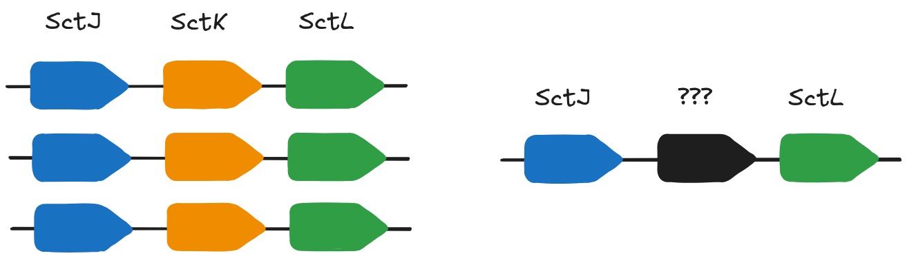

## Database search with predicted structures

Now that we have our high-confidence predicted structure, we can use it to search a large database of annotated structures.
 
Similar annotated structures could provide a hypothesis about the likely function of our target protein.

### Download structure predictions

1. Download the `sample0_alphafold2.pdb` file located in the `output/alphafold2/standard/sample0/` directory. You can find the file by navigating to the `output/alphafold2/standard/sample0/` directory in the VS-code file browser on the left-hand panel.

2. Right-click the `sample0_alphafold2.pdb` file and select `Download`.

### Foldseek

The [Foldseek server](https://search.foldseek.com/search) is extremely fast and useful for identifying structural matches across a range of experimental and predicted structure databases.

> ## Careful
>
> When deciding to send data to an external service, it is important to understand:
> - How the data will be handled (e.g. transferred, processed, stored, secured), and
> - If it is appropriate to submit the data to the service you are intending to use.
>
> Do not send sensitive data to an external service without understanding potential risks.
{: .discussion}

1. Upload our predicted PDB structure to the Foldseek server and search for similar structures. Ensure that the check-boxes for all databases are selected (see screenshot below).

> ## Input form
> 
> 

> 
> 

> 
{: .keypoints}

> ## Results
> 
> 
> 
> 
> - Browse the tabs to see the top hits in various protein structure databases.
> - The most similar proteins in AFDB50 are also uncharacterised proteins.
> - There are some hits to proteins with various annotations (MgtE, FliG, F-box).
> - Many fringe hits are annotated with FliG, YscK and SctK - a component of the Type III secretion system.
>
{: .solution }

> ## Careful
> - Structural similarity does **NOT** guarantee a related function. 
> - Shared structural scaffolds can sometimes adopt highly divergent functions.
> - We can look for complementary evidence to support structure-based annotations.
{: .discussion}

## Synteny

T3SS genes are often found in operons. In genomes where it is annotated, **SctK** is overwhelmingly found between **SctL** and **SctJ**.

1. Return to our original [assembly](https://www.ncbi.nlm.nih.gov/nuccore/LN879502.1) and look at the gene neighbors of our target locus (PNK_0205).

    > ## Gene Neighborhood
    > ~~~
    > gene            complement(256361..257014)
    >                 /gene="sctL"
    >                 /locus_tag="PNK_0204"
    > CDS             complement(256361..257014)
    >                 /gene="sctL"
    >                 /locus_tag="PNK_0204"
    >                 /function="Flagellar biosynthesis/type III secretory
    >                 pathway protein"
    >                 /codon_start=1
    >                 /transl_table=11
    >                 /product="putative type III secretion protein SctL"
    >                 /protein_id="CUI15842.1"
    >                 /translation="MSKKFFSLIYGDQIHTAPETKVIPADSFSVLQDASQVLELIKQD
    >                 AEKYRMQVVKESEQLKEHAEKEGYEEGFKKWAEHLVNLEKEIEKVHQELQQLVIPVAL
    >                 KAAKKIVGKEIELSEDVIVDIVASNLKAVAQHKKVTIFVNKKDLDVLDKNKPRLRDLF
    >                 ESLESLSIRPRDDVASGGCIIETEIGIINAQLEHRWRVLEKAFEGLVKTSPEPEKGS"
    > gene            complement(257017..257859)
    >                 /locus_tag="PNK_0205"
    > CDS             complement(257017..257859)
    >                 /locus_tag="PNK_0205"
    >                 /codon_start=1
    >                 /transl_table=11
    >                 /product="conserved hypothetical protein"
    >                 /protein_id="CUI15843.1"
    >                 /translation="MDKRGWMMLRVFINCYNPKAGEALLKFLPQEEVQAVLSQDIRST
    >                 DLTPILYQPQKLLERMHYSWIEPLLGGFPEKLHPLVMAALTQEQISGLNPVIAPSTLS
    >                 NPVKTFIINQLYTLLKADEHLPYDYLPETDLSPLGTWSKARLTELIDFLGLHDLASEM
    >                 RHIVDKNQLKNIYTSLSSKQFYYLKVCLHQKEILSVPKLGIDPSKRDSTKLKRIVHRR
    >                 GLLRLGKALCGQHPDFVWYLAHTLDTGRGKLILNAYQPESVPQVTSFLKGQVLNLMNF
    >                 LKSE"
    > gene            complement(257888..258895)
    >                 /gene="sctJ"
    >                 /locus_tag="PNK_0206"
    > CDS             complement(257888..258895)
    >                 /gene="sctJ"
    >                 /locus_tag="PNK_0206"
    >                 /function="Type III secretory pathway, lipoprotein EscJ"
    >                 /codon_start=1
    >                 /transl_table=11
    >                 /product="type III secretion lipoprotein SctJ"
    >                 /protein_id="CUI15844.1"
    >                 /translation="MKINCVAARTSIYRFLHQLMVFITLVSVLTSCESRRVIVNGLEE
    >                 KEANEILVFLSTKGINATKVQAATEGGGGGKGILWNISVEETQANEAMALLNQVGLPR
    >                 RRGQNLLGIFANTSLVPSGMQEKIRYQAGLAEQIASTIRKIDGVLDADVQISFPDEDP
    >                 LNPNAPKQKITASVYVKHNGVLDDPNAHLTTRIKRLVSGSVNGLDYDNVTVIGDKARY
    >                 GETPLGGLGGSLGDEEKQYVNVWSIVLAKDSLSRFRIIFFAFTISLVLLLLALIWLLW
    >                 KFLPLLKKVGGFKQLLSFHPIQLGDIATEAKAPEATDAKKEEKAKKSEDDTANQGIDE
    >                 T"
    > ~~~
    {: .solution}

PNK_0205 is between the **SctL** and **SctJ** genes which are also components of the T3SS machinery.

The gene neighborhood of our uncharacterised gene is consistent with our protein structure based annotation.

> ## Note:
> Structure-based annotation is on the roadmap for another nf-core pipeline - [proteinannotator](https://nf-co.re/proteinannotator/dev/)
{: .prereq}

