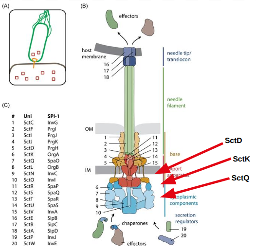
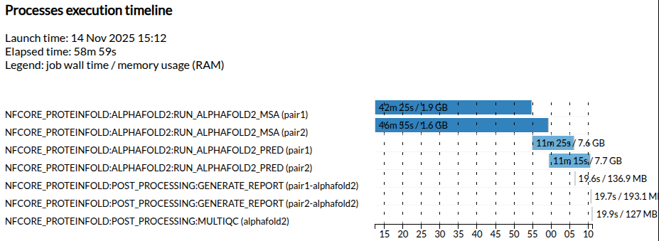
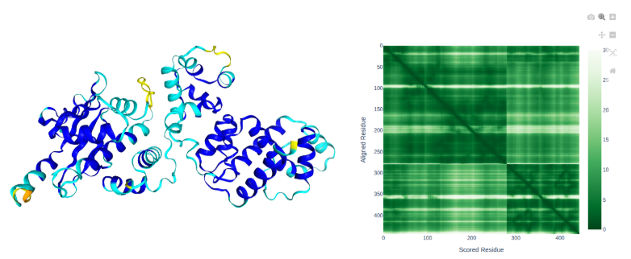
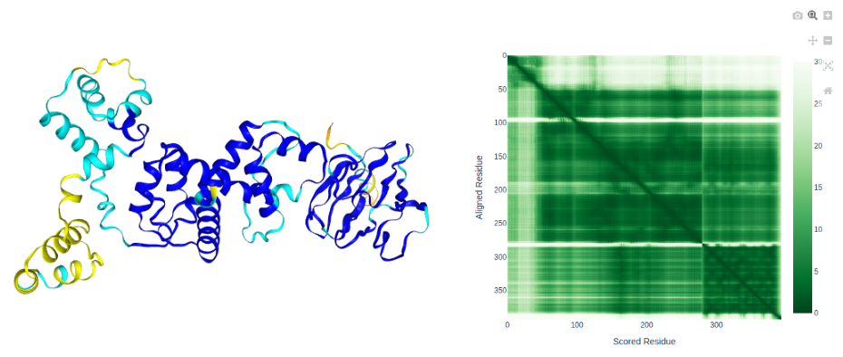

## Binding partners

In the canonical Type III secretion system, **SctK** is known to form direct interactions with **SctD** and **SctQ**.

<p align="center">

</p>

**Available from:** *Samuel Wagner, Iwan Grin, Silke Malmsheimer, Nidhi Singh, Claudia E Torres-Vargas, Sibel Westerhausen, Bacterial type III secretion systems: a complex device for the delivery of bacterial effector proteins into eukaryotic host cells, FEMS Microbiology Letters, Volume 365, Issue 19, October 2018, fny201,*

Can we identify the **SctD** and **SctQ** genes in our target genome?

Let's view our [assembly](https://www.ncbi.nlm.nih.gov/nuccore/LN879502.1) on the NCBI website and search for genes annotated as **SctD** and **SctK**.


> ## SctD
> 
> ~~~
> gene            complement(430545..432425)
>                 /gene="sctD"
>                 /locus_tag="PNK_0343"
> CDS             complement(430545..432425)
>                 /gene="sctD"
>                 /locus_tag="PNK_0343"
>                 /function="FOG: FHA domain"
>                 /codon_start=1
>                 /transl_table=11
>                 /product="putative type III secretion system protein SctD"
>                 /protein_id="CUI15980.1"
>                 /translation="MVARLVAEEGDLKGLILSLENGDTWVIGRDPDECQLVIQDPLTS
>                 RKHLVARRTPEGISVENLSSTNPIQINEEEIGEQPRILQQGDTVKIGNEVFRYYTDTS
>                 AHVLDEGSPSEVKEPSEQTPIEIDDHPNPASAYPLHSQDRSESEEEKENDTIFDEDEE
>                 SFSPLAEINFGIAETGRWLLKVIGGPNNGAEFYMQAGHSYILGTDPHSCDIVFQDTSV
>                 SRQHAKIIVSPEDSLAIEDLKSRNGVLVSGAPVEGKQALIPSMIVTIGTTSFVVYDRE
>                 GEMQTIISPLLPSIVKVLQHEEEAPKIEEVPPPAPVEVEAAAATPPPEPAHHFGPYIL
>                 LAIIIGLFVLAGIGTTALFKSEPVVTLTQENAPELVQQALDSFPAVRHSYNKTSGNLL
>                 LLGHVRSQAEKNQLMYNLQGLKFIKNIDDSGIIIDEFVWREINSVLSKDPAWKGITIH
>                 SPEAGQFILSGYLETRKQAEQLSDYISVNFPYLDLLKKQVVVEEDVITQINVWLQTFN
>                 LRGVSAKIANGGEVTLSGNAPSDKAGEITQLIAKIKGISGVRLVNNYIKSEAPEMGIV
>                 NLSDRYEITGQSRLGTRYTVVINGRILSEGDSLDSMVITSIKPHAVFLEKDGTKYRID
>                 YK"
> ~~~
{: .solution}

> ## SctQ
> 
> ~~~
> gene            complement(421992..423308)
>                 /gene="sctQ"
>                 /locus_tag="PNK_0334"
> CDS             complement(421992..423308)
>                 /gene="sctQ"
>                 /locus_tag="PNK_0334"
>                 /function="Flagellar motor switch/type III secretory
>                 pathway protein"
>                 /codon_start=1
>                 /transl_table=11
>                 /product="putative type III secretion translocase SctQ"
>                 /protein_id="CUI15971.1"
>                 /translation="MTTPPTSYDWIRTIDPELKALDTIPLTGAAPSFPWADLSSRLAR
>                 SFDREGFSIQPKDIMWRTTDQLYDGLGDSPFPLIFAVPILKGDVCWVMPEQEMVLLET
>                 WLLTKESHPISFQDRALSESFYRFFALEVLYHLSQTSFDKSIAPILTNKTVLPQEDAL
>                 CLDISLSMHDQTLWGRLIISPDLRHSWVEHYASHGPSPLTQQMAQAVEVQVHLEAGKT
>                 QLSLAEWSAVSLGDFIVLDSCSLDADGSAGRVMLTVNGKAAHRGKIKDGNLKILELPL
>                 IQEVNPPPLQALNTPQEVPPPMAKHEDEDEDDLSDLDFTEDEELEDEESFDESLLNDE
>                 EEEKLSPPPAKPVKPEPSKVETSAKPVSETPYTPEHIPVALTVEVGRIQMTMENLLRL
>                 EPGNMLELNVHPEDGVDLTINGKLVGRGELLRIGENLGVRVLELGR"
> ~~~
{: .solution}

Let's see if our uncharacterised protein is predicted to form a high confidence interaction with either of these potential partners.

> ## NOTE
> To reduce the time required for prediction, we have trimmed the **SctD** and **SctQ** genes to the minimal region which would be expected to interact with a *bona fide* **SctK** gene.
{: .prereq}

## Construct samplesheet

Navigate to the new working directory for this exercise

```bash
cd $MYSCRATCH/2025-ABACBS-workshop/exercises/exercise3/
```

Check that the FASTA files for the two target complexes are available in the `fasta/` directory.

```bash
cat fasta/SctD-complex.fasta
```

Output:
```
> PNK_0205
MDKRGWMMLRVFINCYNPKAGEALLKFLPQEEVQAVLSQDIRSTDLTPILYQPQKLLERMHYSWIEPLLGGFPEKLHPLVMAALTQEQISGLNPVIAPSTLSNPVKTFIINQLYTLLKADEHLPYDYLPETDLSPLGTWSKARLTELIDFLGLHDLASEMRHIVDKNQLKNIYTSLSSKQFYYLKVCLHQKEILSVPKLGIDPSKRDSTKLKRIVHRRGLLRLGKALCGQHPDFVWYLAHTLDTGRGKLILNAYQPESVPQVTSFLKGQVLNLMNFLKSE
> SctD
IAETGRWLLKVIGGPNNGAEFYMQAGHSYILGTDPHSCDIVFQDTSVSRQHAKIIVSPEDSLAIEDLKSRNGVLVSGAPVEGKQALIPSMIVTIGTTSFVVYDREGEMQTIISP
```

```bash
cat fasta/SctQ-complex.fasta
```

Output:
```
> PNK_0205
MDKRGWMMLRVFINCYNPKAGEALLKFLPQEEVQAVLSQDIRSTDLTPILYQPQKLLERMHYSWIEPLLGGFPEKLHPLVMAALTQEQISGLNPVIAPSTLSNPVKTFIINQLYTLLKADEHLPYDYLPETDLSPLGTWSKARLTELIDFLGLHDLASEMRHIVDKNQLKNIYTSLSSKQFYYLKVCLHQKEILSVPKLGIDPSKRDSTKLKRIVHRRGLLRLGKALCGQHPDFVWYLAHTLDTGRGKLILNAYQPESVPQVTSFLKGQVLNLMNFLKSE
> SctQ
WADLSSRLARSFDREGFSIQPKDIMWRTTDQLYDGLGDSPFPLIFAVPILKGDVCWVMPEQEMVLLETWLLTKESHPISFQDRALSESFYRFFALEVLYHLSQTSFDKSIAPILTNKTVLPQEDALCLDISLSMHDQTLWGRLIISPDLRHSWVEHYASHGPSPL
```

Confirm that the samplesheet in the working directory points to the FASTA files containing the proteins we want to predict.

```bash
cat samplesheet.csv
```

Output:
``` csv
id,fasta
pair1,fasta/SctD-complex.fasta
pair2,fasta/SctQ-complex.fasta
```

> ## Note
> 
> Normally, AlphaFold2 generates predictions using 5 copies of the model which all output different predictions. 
> 
> In multimer mode, each of these 5 models is run with 5 independent replicates (5 x 5 = 25 total).
> 
> All of these outputs are ranked by model confidence.
> 
> Today, we are using a custom fork (`alphafold2_pred-single.sif`) of AlphaFold2 which enables running only 1 of the 5 models.
> 
> We also provide an additional argument to run only a single replicate of this model (`-num_multimer_predictions_per_model=1`).
>
> ~~~
> grep -A4 RUN_ALPHAFOLD2_PRED abacbs_profile-multimer.config
> ~~~
> {: .source}
> <br>
> Output:
> ~~~
> withName: 'RUN_ALPHAFOLD2_PRED' {
>     container = '/scratch/references/abacbs2025/containers/alphafold2_pred-single.sif'
>     ext.args = '--num_multimer_predictions_per_model=1'
>     time = { 12.h }
>}
> ~~~
> <br>
> These optimizations can reduce the GPU requirements by **up to 25x** for a small tradeoff in prediction quality.
> 
> This could be important if we wish to scale to 1000s of predictions.
>
{: .prereq}


## Predict multimers

~~~ bash
nextflow run nf-core/proteinfold --input samplesheet.csv --outdir output \ 
    --db /scratch/references/abacbs2025/databases/ \
    --mode alphafold2 --alphafold2_model_preset multimer --use_gpu \
    -c abacbs_profile-multimer.config --slurm_account $PAWSEY_PROJECT -r 53a1008
~~~
{: .source}

Nextflow can automatically distribute work across the available compute resources.

In our second terminal, check the status of the queue.

```bash
squeue --me
```

```
JOBID        USER ACCOUNT                   NAME EXEC_HOST ST     REASON START_TIME       END_TIME  TIME_LEFT NODES   PRIORITY       QOS
34806314  tlitfin pawsey1017      nf-NFCORE_PROT nid002040  R       None 09:16:39         21:16:39   11:59:37     1      75342    normal
34806313  tlitfin pawsey1017      nf-NFCORE_PROT nid002040  R       None 09:16:37         21:16:37   11:59:35     1      75342    normal
```

We can see that multiple jobs have been initiated and are able to run in parallel.

In our original terminal, wait for the MSA jobs to finish as indicated by the tick below.

```
[de/35e5fe] NFC…ALPHAFOLD2:RUN_ALPHAFOLD2_MSA (pair2) | 2 of 2 ✔
[fc/fb9ce4] NFC…LPHAFOLD2:RUN_ALPHAFOLD2_PRED (pair2) | 0 of 2
[-        ] NFC…NFOLD:POST_PROCESSING:GENERATE_REPORT -
[-        ] NFC…E_PROTEINFOLD:POST_PROCESSING:MULTIQC -
```

Before the pipeline is completed, cancel the execution by pressing `Ctrl` + `c`.

> ## Interruptions
> 
> During long-running workflows, jobs can crash or be interrupted which can lead to lost progress.
> 
> Nextflow has the ability to resume workflow executions without repeating completed work.
{: .prereq}

Re-start our multimer predictions using the original command in combination with the `-resume` parameter.

~~~ bash
nextflow run nf-core/proteinfold --input samplesheet.csv --outdir output \ 
    --db /scratch/references/abacbs2025/databases/ \
    --mode alphafold2 --alphafold2_model_preset multimer --use_gpu \
    -c abacbs_profile-multimer.config --slurm_account pawsey1017 -r 53a1008 -resume
~~~
{: .source}

```
[54/a90051] NFC…ALPHAFOLD2:RUN_ALPHAFOLD2_MSA (pair1) | 2 of 2, cached: 2 ✔
[fc/fb9ce4] NFC…LPHAFOLD2:RUN_ALPHAFOLD2_PRED (pair1) | 0 of 2 
[-        ] NFC…NFOLD:POST_PROCESSING:GENERATE_REPORT -
[-        ] NFC…E_PROTEINFOLD:POST_PROCESSING:MULTIQC -
```

We can see that Nextflow keeps track of completed tasks and continues from the latest checkpoint.

## Execution timeline
<p align="center">

</p>

Observe in the full run that the 2 MSA jobs are executed in parallel.

Note that this will depend on the resources available when the workflow is being executed.

## Results

After the workflow has completed, view the `pair1_alphafold2_report.html` file located in the `output-multimer/generate/` directory.

You can find the file by navigating to the `exercises/exercise3/output-multimer/generate/` directory in the VS-code file browser on the left-hand panel.

Right-click the `pair1_alphafold2_report.html` file and select `Preview`.

> ## SctD
> 
> <p align="center">
> 
> </p>
> 
> - Our uncharacterised protein forms a high confidence interaction with SctD
{: .solution}

> ## SctK
> 
> <p align="center">
> 
> </p>
> 
> - Our uncharacterised protein forms a high confidence interaction with SctQ
{: .solution}


> ## Thought: 
> Can we screen for potential interactions systematically?
{: .prereq}

