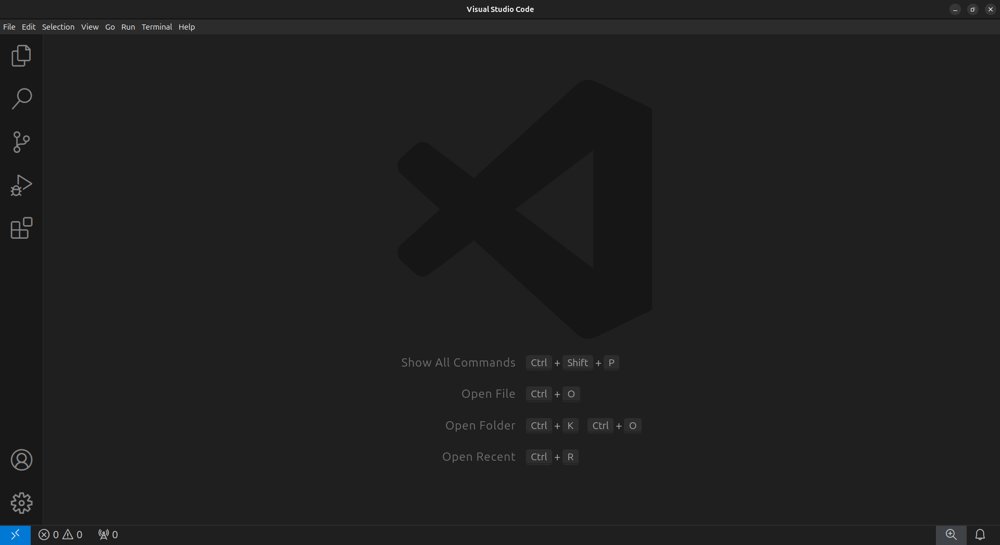
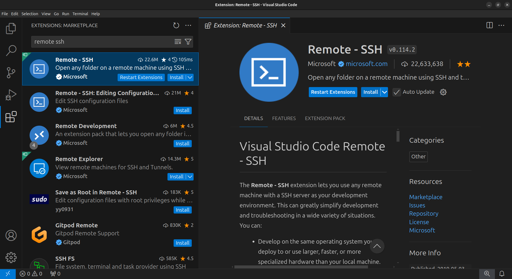

## Key requirements

The main requirement for this workshop is a personal computer with a web browser and [Visual Studio Code (`VSCode`)](https://code.visualstudio.com/). This equipment will allow you to follow the online materials and login to a facility with the required software stack.

You should also be familiar with bash scripting. This is an introduction to Bash that you might find useful: [The Unix Shell: Summary and Setup](https://swcarpentry.github.io/shell-novice/) 

### Suggested

- Google account to run colab notebooks: [ColabFold](https://colab.research.google.com/github/sokrypton/ColabFold/blob/main/AlphaFold2.ipynb#scrollTo=mbaIO9pWjaN0) and [SPfast](https://colab.research.google.com/github/tlitfin/SPfast/blob/main/notebooks/SPfast_AFDB_clusters_PFAM.ipynb).

### Recommended for use after the workshop

- Molecular Viewer installed (PyMOL/ChimeraX)

## Set up your computer

In this workshop, we will use the [Setonix HPC](https://pawsey.org.au/systems/setonix/) at [Pawsey Supercomputing Research Centre](https://pawsey.org.au/) (Perth, WA). 

Each participant will be provided with their training account and password at the workshop.

Before the workshop, you must have the following:

1. `VSCode` installed.
2. The `Remote - SSH` VSCode extension installed.

Below, you will find instructions on how to set up VSCode.

## Installing Visual Studio Code

Visual Studio Code (`VSCode`) is a versatile code editor that we will use for the
workshop. We will use `VSCode` to connect to the HPC, download and execute the Proteinfold workflow, monitor jobs on the HPC, and edit, view and download files.

1. Download `VSCode` by following the [installation instructions](https://code.visualstudio.com/docs/setup/setup-overview) for your local Operating System.

2. Open `VSCode` to confirm it was installed correctly.

## Installing the `Remote - SSH` VScode extension

1. In the VSCode sidebar on the left, click on the extensions button (four blocks)

2. In the Extensions Marketplace search bar, search for `remote ssh`. Select **"Remote - SSH"**

**You have now configured VSCode for the workshop!**

## Acknowledgements

Setup content copied and adapted with permission from a Sydney Informatics Hub (SIH, University of Sydney) [Nextflow and HPC workshop](https://sydney-informatics-hub.github.io/nextflow-hpc-workshop/).
